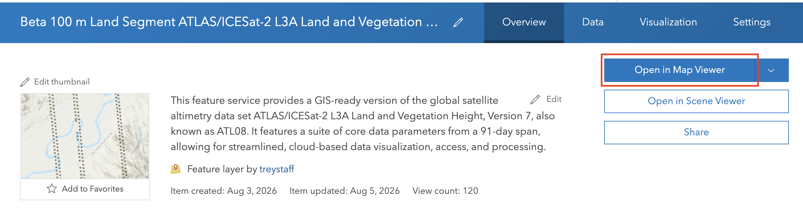
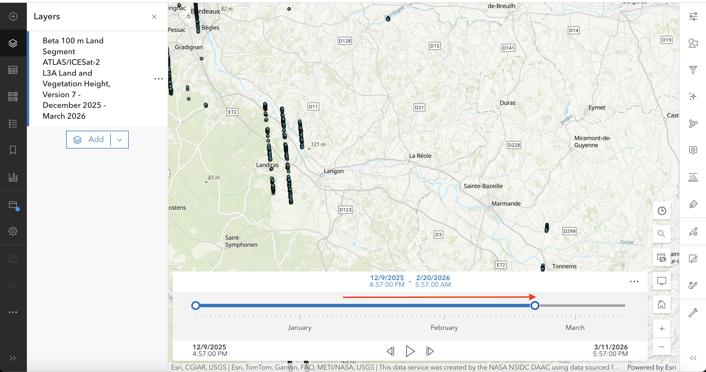
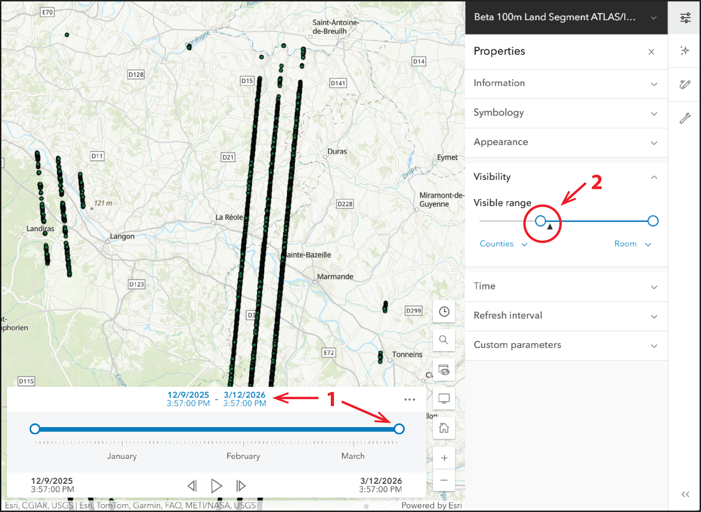
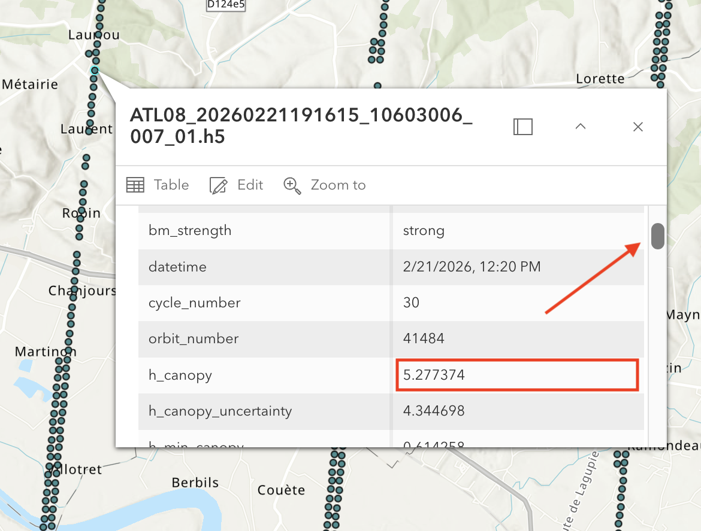
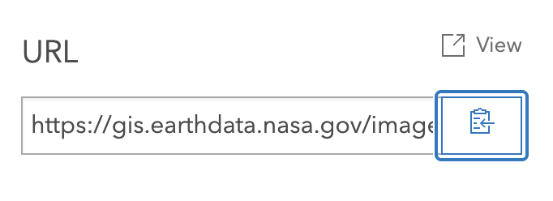
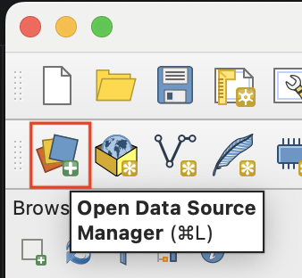
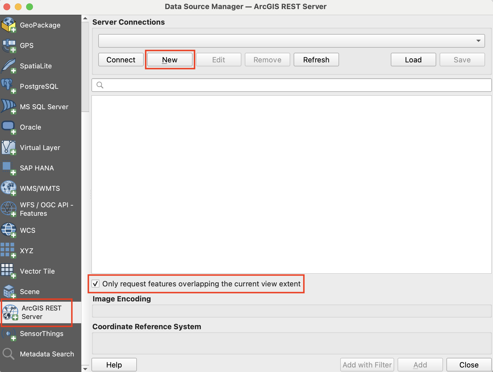
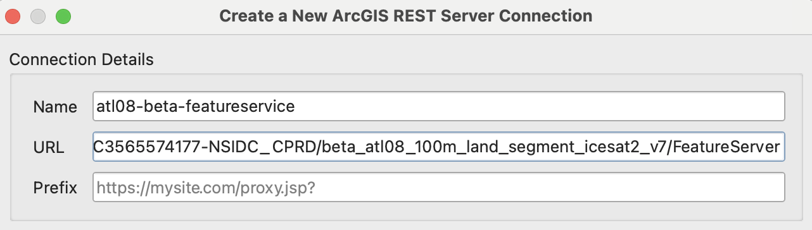
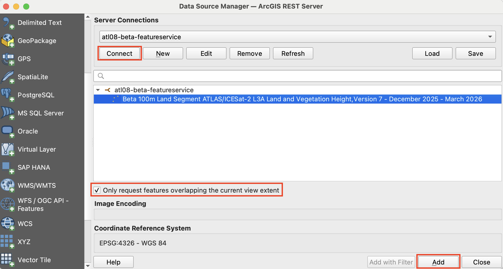
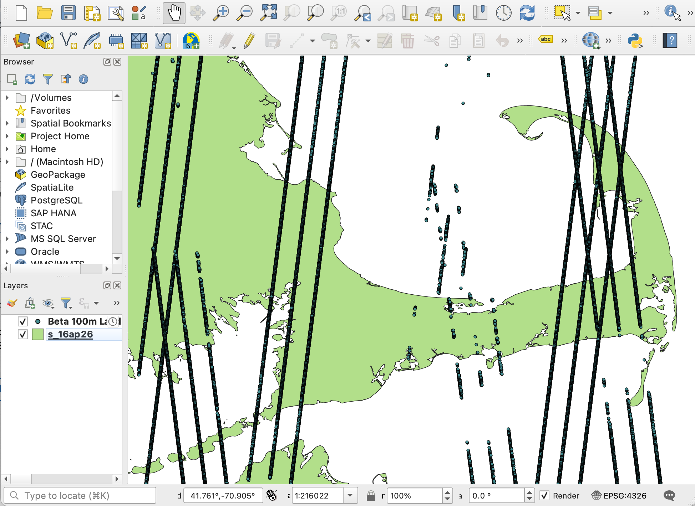

Authored by Diane Fritz, NSIDC DAAC

Versions used: AGOL?, QGIS 3.xx.x, ArcGIS Pro 3.x.x

## Summary

The NSIDC DAAC is working on providing some of our data sets as GIS layers on the [NASA Earthdata GIS (EGIS)](https://gis.earthdata.nasa.gov/portal/home/index.html) system. This example goes through accessing the ICESat-2 Land and Vegetation Height (ATL08) data set on EGIS and working with it in different Geographical Information System (GIS) platforms.

*Note that this data is a simplified version of the HDF5 files for ATL08*

For more details on these EGIS services for ICESat-2's ATL08, please see our [Feature Service page](https://gis.earthdata.nasa.gov/portal/home/item.html?id=809dc2ec6339461e81109dc5a1262131)

### Learning Objectives

- Connecting to the ATL08 Feature Service through the Map Viewer, QGIS, or ArcGIS Pro.
- Loading reasonably-sized amounts of data using restricted areas
- Exploring variables available in the EGIS ATL08 data

### Map Viewer

A simple way to view the ICESat-2 Land and Vegetation Height (ATL08) data through EGIS is to select `Open in Map Viewer` from the [feature layer landing page](https://gis.earthdata.nasa.gov/portal/home/item.html?id=809dc2ec6339461e81109dc5a1262131).

{width=80% fig-alt="data feature service landing page" fig-align="center"}

The Map Viewer will initially load focused on a small region and at a narrow time window. Adjusting the spatial and temporal view will help you see your desired data. Be patient as the dot flickers on the layer menu indicating loading.

Adjust the time-slider to the right to capture the full temporal span. This beta service includes a 91-day span of ATL08, which covers a single full pass of the ICESat-2 satellite before it repeats along a reference ground track (RGT).

(Using the map image layer service will provide different behavior - you will see the full time span automatically loaded and the loading will be faster but tools will be fewer.)

{width=80% fig-alt="data page showing time slider" fig-align="center"}

The default spatial view is at the widest zoom level the laser altimetry 100m land segment data points are visible. ATL08 is a global data set but data representation in Map Viewer is not available for all zoom levels for performance reasons. Find your region of interest and zoom back in to at least the default scale to see the available data. You can be sure you're in a visible zoom range by checking the Properties > Visibility settings on the right side menu. Check that the black triangle showing your present zoom level is within the correct range. Be sure you've adjusted the time slider to the full span.

{width=80% fig-alt="settings for map viewer" fig-align="center"}

If you zoom in and click on a single point representing a 100m land segment, you'll see its associated parameters and values. If you select a data point where there is no canopy, those values will be blank, but scroll down to see the terrain data.

{width=50% fig-alt="pop-up showing available variables" fig-align="center"}

### QGIS

To work with this data in QGIS, you will access the feature service via the ArcGIS REST service endpoint available in the lower right of the [feature layer landing page](https://gis.earthdata.nasa.gov/portal/home/item.html?id=809dc2ec6339461e81109dc5a1262131). Copy the URL available there:

{width=40% fig-alt="URL copy location" fig-align="center"}

Adding data from this service without overwhelming QGIS requires that you first adjust your working space to the AOI for which you need the data. QGIS cannot load the whole globe at once. Preload other data or a base map and zoom into your area of interest.

To make a connection to the service, open the data source manager from the main `Layer` dropdown menu or from the toolbar as shown in the following figure. (Look for the icon with three primary-colored cards and a plus sign.)

{width=15% fig-alt="Q G I S data source manager icon" fig-align="center"}

A new window will open that gives you diffent kinds of data loading options down the left side. Select `ArcGIS REST Server`, click `New`, then add the copied URL after giving your connection a name.

{width=80% fig-alt="REST service choice on right menu" fig-align="center"}

{width=50% fig-alt="creating new U R L connection" fig-align="center"}

IMPORTANT: Be sure to limit the data to your AOI by checking the box for `Only request features overlapping the current view extent`

Once you've entered the URL and added the connection to your system, click `Connect`, click on the layer you want so it's highlight in blue, be sure the current view request toggle is on, then click `Add` and you'll have the data in your map!

{width=80% fig-alt="highlight data layer and click add" fig-align="center"}

Any granule (file) of ATL08 that has any data over land in your region of interest will be loaded. You may see data over water if the granule extends beyond the land, so be careful interpreting the data. Also, clouds block data production for ATL08 so you may see discontinous coverage.

{width=80% fig-alt="A T L eight data loaded over Cape Cod Massachusetts" fig-align="center"}

### ArcGIS Pro

- importing feature service with URL (coming soon!)